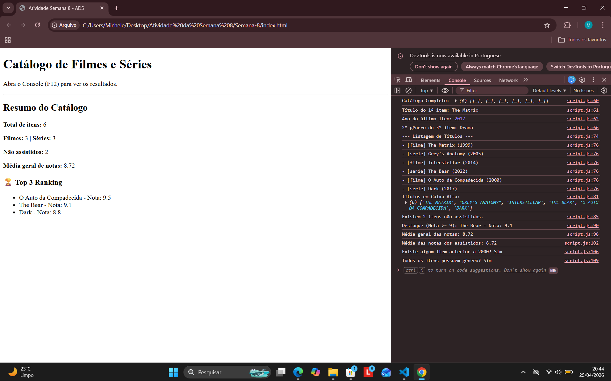

Trabalho Prático - Semana 08

Nesta atividade, você fazer exercícios de programação para vai praticar a manipulação de objetos e arrays em JavaScript, passando pela definição de dados em notação JSON (JavaScript Object Notation), acessando propriedades e itens, e usando iterators para processar os dados e gerar resultados.

Informações Gerais

**Nome:** Michele Fortunato Lima

**Matrícula:** 928047

**Proposta de projeto:** Manipulação de Objetos e Arrays utilizando JSON

**Breve descrição sobre seu projeto:**  Nesta atividade, eu desenvolvi um catálogo de filmes e séries para praticar a manipulação de dados com JavaScript. Criei uma estrutura de dados usando objetos e arrays (JSON) e utilizei métodos modernos como map, filter e reduce para processar essas informações. O projeto calcula automaticamente médias de notas, filtra itens não assistidos e gera um resumo estatístico que é exibido tanto no console do navegador quanto diretamente na tela para o usuário.Nesta atividade, eu desenvolvi um catálogo de filmes e séries para praticar a manipulação de dados com JavaScript. Criei uma estrutura de dados usando objetos e arrays (JSON) e utilizei métodos modernos como map, filter e reduce para processar essas informações. O projeto calcula automaticamente médias de notas, filtra itens não assistidos e gera um resumo estatístico que é exibido tanto no console do navegador quanto diretamente na tela para o usuário.

## Prints do Projeto

### Console e Interface
Nesta imagem é possível visualizar a listagem de títulos, o cálculo das médias e o resumo estatístico gerado dinamicamente:

